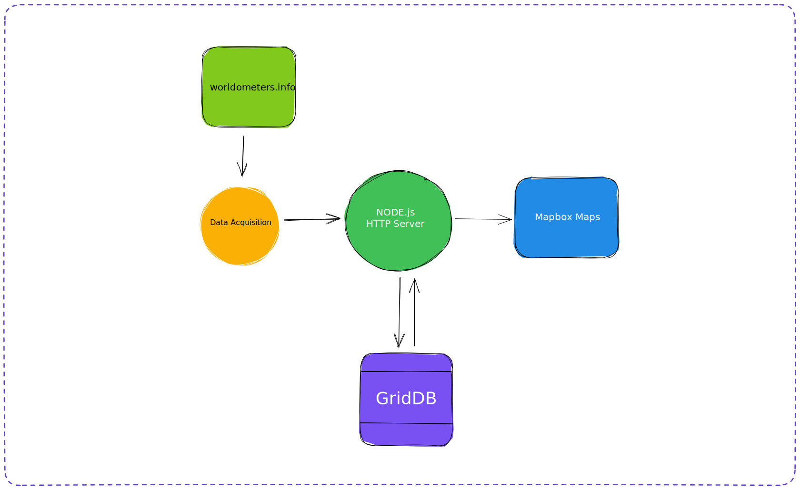

# Visualize Global Population Data with Mapbox, Node.js, and GridDB

## What We Will Build?


This blog will teach you how to create a web-based map displaying world population data. The data is extracted from [worldometers](https://www.worldometers.info/) using React, Mapbox GL JS, Node.js, and GridDB. The world map will display the top 10 countries with the most population data.

## The Development Flow



The development flow for this project can be breakdown into a few steps:

## Data Acquisition

First, we need to get real-time data from [worldometers](https://www.worldometers.info/). We can get the data by scrapping the website or using API and then getting the needed data.

The data will be extracted at regular intervals and then stored in the GridDB database. The data stored can be used for further analysis, prediction, reporting, etc.

## Back-end Development

We will use Node.js to code the server-side application server.

> Why Node.js? JavaScript is the lingua franca for full-stack application development, so it's the obvious choice.

The application server we make is API-based, and Node.js will interact with GridDB for data storage, handle retrieval data from worldometers, and handle requests and responses from the client UI.

## Front-end Development

We use React.js to create the user interface. To display the world population data visually, we'll use Mapbox GL JS, a powerful mapping library. This library enables the creation of interactive, customizable maps. We'll integrate Mapbox GL JS with our React application to render a world map with markers or overlays representing the population data.

## Prerequisite

Before we code the application, we need to set up the software and tools for development. We use Ubuntu 20.04 on WSL 2 on Windows 11 OS.

> WSL is only available on Windows 10 version 2004 and higher (Build 19041 and higher). Go ahead to this [link](https://learn.microsoft.com/en-us/windows/wsl/install) for a new WSL installation.

## GridDB

[GridDB](https://griddb.net/en/)™ is a highly scalable, in-memory NoSQL time-series database optimized for IoT and Big Data. What's important to note is it has two types of container categories:

### Collection Containers

This type of container is similar to a traditional relational database. The data is stored as key values, and the collection container support basic CRUD (Create, Read, Update, and Delete) operation.

### TimeSeries Containers

This container is designed explicitly for managing time-series data, a sequence of data points indexed by time. Each record in a TimeSeries container has a timestamp, which serves as its unique key, and the data in this container is "append only" except upon deletion if requested.

### Installation

⚠️ GridDB deb package uses `systemd`, but Ubuntu 20.04 on WSL 2 Windows 11 uses `SysVinit`, so you need to enable `systemd` on Ubuntu WSL by editing the file `/etc/wsl.conf` (create it if this file doesn't exist)

Inside your Ubuntu instance, add the following modification to `/etc/wsl.conf`[^1]

```ini
[boot]
systemd=true
```

Open the Windows terminal to restart wsl with the following command.

```powershell
wsl --shutdown
```

Then start wsl again with the command.

```powershell
wsl
```

To install GridDB, follow the installation instruction on [https://docs.griddb.net/latest/gettingstarted/using-apt/#install-with-apt-get](https://docs.griddb.net/latest/gettingstarted/using-apt/#install-with-apt-get).

Run GridDB and check if the service is running. Use this command

```zsh
sudo systemctl status gridstore
```

And if everything ok you will get a message like this.

```zsh
● gridstore.service - GridDB database server.
     Loaded: loaded (/lib/systemd/system/gridstore.service; enabled; vendor preset: enabled)
     Active: active (running) since Thu 2023-03-16 18:56:13 +07; 58min ago
    Process: 314 ExecStart=/usr/griddb/bin/gridstore start (code=exited, status=0/SUCCESS)
   Main PID: 393 (gsserver)
      Tasks: 34 (limit: 4605)
     Memory: 138.5M
        CPU: 20.129s
     CGroup: /system.slice/gridstore.service
             └─393 /usr/bin/gsserver --conf /var/lib/gridstore/conf

Mar 16 18:56:10 GenAI systemd[1]: Starting GridDB database server....
Mar 16 18:56:10 GenAI gridstore[314]: Starting gridstore service:
Mar 16 18:56:13 GenAI gridstore[392]: ..
Mar 16 18:56:13 GenAI gridstore[392]: Started node.
Mar 16 18:56:13 GenAI gridstore[314]: [ OK ]
Mar 16 18:56:13 GenAI systemd[1]: Started GridDB database server..
```

## Node.js

To install[^2] Node.js LTS, follow the commands below

```zsh
curl -fsSL https://deb.nodesource.com/setup_18.x | sudo -E bash - &&\
sudo apt-get install -y nodejs
```

We will be using [griddb node-api](https://github.com/griddb/node-api) to connect our application with GridDB, but before that, we should install the [griddb c client](https://github.com/griddb/c_client). The GridDB C Client provides a C interface for GridDB.

```zsh
wget https://github.com/griddb/c_client/releases/download/v5.0.0/griddb-c-client_5.0.0_amd64.deb
sudo dpkg -i griddb-c-client_5.0.0_amd64.deb
```

### GridDB node-api

To connect to GridDB from Node.js. We should use `griddb-node-api`. This package is built using node-addon-api, and there are two ways to use it:

1. Compile from the source code. This way is the right way if you need to use griddb-node-api on a specific node.js version.

```zsh
git clone git@github.com:griddb/node-api.git
cd node-api
npm install
```

If there is an error message like this

```zsh
gyp ERR! stack Error: not found: make
```

That means you should install the `build-essentials` package in Ubuntu, and if everything success you will get a file, `griddb.node`, and then you need to include it in `NODE_PATH`

```zsh
export NODE_PATH=$(pwd)
```

2. Install the npm package `griddb-node-api` directly into our project.

```zsh
pnpm install griddb-node-api
```

We will use the second way for our project because it's simpler, and we use Node 18 LTS.

## VSCode

As stated earlier, we use OS Ubuntu 20.04 on WSL Windows 11. To code from Windows, we use Visual Studio Code because it has a remarkable [remote WSL plugin](https://marketplace.visualstudio.com/items?itemName=ms-vscode-remote.remote-wsl)


Ok. That's a long setup before we code the application itself, but it's necessary so our development environment is transparent.

## Project Structure Directory

We use `pnpm` instead of npm because `pnpm` is storage efficient and supports workspaces. We will create a monorepo that holds server and client codes.

_Why monorepo?_

Because it's good for future development, if you want to add another collaborator, everyone will be working on the same code base.

Start the project by creating a directory for the monorepo

```zsh
mkdir world-population
cd world-population
pnpm init
```

Then create `packages` directory that will hold our `server` and `client` projects.

```zsh
mkdir packages
mkdir paclages\data-server
mkdir packages\client
```

`pnpm` handling project workspaces by reading the config from `pnpm-workspaces.yaml`

```yaml
# pnpm-workspaces.yaml
packages:
  # all packages in direct subdirs of packages/
  - "packages/*
```

This tree structure might be typical of a Node.js project that has separate client and server codebases, organized as packages within a monorepo, and managed with the `pnpm` package manager.

```sh
.
├── .gitignore
├── package.json
├── packages
│   ├── data-server
│   └── client
└── pnpm-workspaces.yaml
```

## Let's Code

First, we initialize the server project and install the main npm packages.

```sh
cd packages/server
pnpm init
cd ../../
pnpm --filter server install griddb-node-api express ws puppeteer
```

### Data Extraction

This project uses data from Worldometers.

> Worldometers is a website that provides real-time statistics on various topics, including world population, government and economics, society and media, the environment, food, water, energy, and health.

There are a few ways to get data from a website:

1. By using their API.
2. By scrapping the website.

Unfortunately, Worldometers does not provide API, so our last option is to scrap the website. One thing to note is Worldometers have dynamic data, meaning they provide real-time data. You cannot use JavaScript libraries such as Cheerio for data extraction. The best choice is to use Puppeteer to get such dynamic content.

> Puppeteer can be more resource-intensive as it launches a headless browser instance to render web pages. However, it offers more capabilities, such as handling dynamic content and user interactions.

Two endpoint URLs will provide us with the data. One is for the total world population, and the second is for the total world population by country.

- https://www.worldometers.info/world-population/
- https://www.worldometers.info/world-population/population-by-country/

```js
const worldPopDataSource = "https://www.worldometers.info/world-population/";
/**
 * fetch world population data
 */
const fetchWorldPopulationData = async () => {
  const browser = await puppeteer.launch();
  const page = await browser.newPage();

  await page.goto(worldPopDataSource);

  const extractData = async () => {
    // Extract data from the page
    const data = await page.evaluate(() => {
      const populationElement = document.querySelector(".rts-counter");
      const population = populationElement.textContent.replace(/[\n\s]+/g, "");
      return { population };
    });

    return data;
  };

  const popData = await extractData();
  await browser.close();

  return popData;
};
```

The data returned by `fetchWorldPopulationData` function is simply a JavaScript object

```js
{
  type: 'worldPopulationData',
  worldPopulation: {
    population: '8,022,758,957',
    timestamp: 1679222700112
  }
}
```

The code for data extraction of world population by country is in the repository project. The output will be an array, so it's so easy to process.


## Data Store

We will use both types of containers for our project, time-series and collection container. Time series for storing world population data and the collection container for storing world population data by country.

As with any other database, we need to connect to it first. On GridDB, we need to connect to the cluster. You can see the cluster configuration at

```zsh
/var/lib/gridstore/conf/gs_cluster.json
```

Make sure that the port is the value of the transaction key.

```js
const initStore = async () => {
  const factory = griddb.StoreFactory.getInstance();
  try {
    // Connect to GridDB Cluster
    const store = await factory.getStore({
      host: "127.0.0.1",
      port: 10001,
      clusterName: "myCluster",
      username: "admin",
      password: "admin",
    });
    return store;
  } catch (e) {
    throw e;
  }
};
```

After that, we need to create a container to store our data. The `initContainer()` function provides information about the container's schema, including the names and data types of its columns.

```js
function initContainer() {
  const conInfo = new griddb.ContainerInfo({
    name: containerName,
    columnInfoList: [
      ["timestamp", griddb.Type.TIMESTAMP],
      ["value", griddb.Type.DOUBLE],
    ],
    type: griddb.ContainerType.TIME_SERIES,
  });

  return conInfo;
}
```

Please note that the `initContainer()` function will not create a container. The GridDB API that does that is `putContainer()`

```js
async function createContainer(store, conInfo) {
  try {
    const timeSeriesDB = await store.putContainer(conInfo);
    return timeSeriesDB;
  } catch (err) {
    console.error(err);
    throw err;
  }
}
```

### How to Store the Data

Store the data is pretty easy. Get the container connection, then use `put()` to save the data into the GridDB container.

```js
db.put(data);
```

`db` is the connection reference that is returned by `createConnection()` function.

The important thing to note for this project is the data should be stored periodically. The simplest way to do this is by using JavaScript native function, `setInterval()`.

```js
function updateClientsWithWorldPopulationDataPeriodically(clients) {
  updateClientsWithWorldPopulationData(clients);
  setTimeout(
    () => updateClientsWithWorldPopulationDataPeriodically(clients),
    worldDataUpdateTime
  );
}

// Call the function to start the periodic updates
updateClientsWithWorldPopulationDataPeriodically(wss.clients);
```

The default time to extract data is set by variable `worldDataUpdateTime` which is 5 second.

## Read Data from GridDB

GridDB supports SQL, so you can use raw SQL to retrieve the data. It is pretty simple. By using `query()` and `fetch()` we can easily get the data based on a SQL query.

```js
async function queryAll(db) {
  const query = db.query(
    `SELECT * FROM ${containerName} ORDER BY timestamp DESC LIMIT 1`
  );

  try {
    const rowset = await query.fetch();
    const results = [];

    while (rowset.hasNext()) {
      const row = rowset.next();
      const rowData = { timestamp: `${row[0]}`, population: row[1] };
      results.push(rowData);
    }

    return results;
  } catch (err) {
    console.log(err);
    throw err;
  }
}
```

We need to display the latest data with the latest time stamp. We can use SQL queries to achieve this.

```sql
SELECT * FROM [containerName] ORDER BY timestamp DESC LIMIT 1
```

## Deliver Data to the Web Client

We use WebSocket to deliver data to the project web client, built with React and Mapbox.

_Why WebSocket?_

> WebSocket is the optimal choice for applications requiring intensive data usage because it enables real-time, bidirectional communication between the client and server. WebSocket allows for efficient data transfer and minimizes latency, which is essential in data-intensive applications where continuous updates and rapid responsiveness are crucial.

This snippet code shows us how the world population data is saved to and queried from GridDB and then sent it to the web client via WebSocket `ws`.

```javascript
const worldPopData = [worldPopulation.timestamp, worldPopulation.population];
await GridDB.insert(worldPopData, timeSeriesDb);

const result = await GridDB.queryAll(timeSeriesDb);

const jsonArray = result.map((item) => {
  return {
    timestamp: item.timestamp.toString(),
    population: item.population,
  };
});

// client is WebSocket client
clients.forEach((client) => {
  if (client.readyState === WebSocket.OPEN) {
    try {
      client.send(JSON.stringify(jsonArray));
    } catch (error) {
      console.error("Error sending data to client:", error);
    }
  }
});
```

In this project we use [ws](https://github.com/websockets/ws) for WebSocket and [express.js](http://expressjs.com/) for HTTP server.

## Web Client React + Mapbox GL JS

There are so many tools today for creating React-based applications. [Vite](https://vitejs.dev/) is a next-generation front-end tool. It offers enhanced speed, supports ESM, and React. Making it a standout choice.

```zsh
pnpm create vite
cd client
pnpm install
```

The command will ask you a few questions and make sure to choose JavaScript and React. The source code for web client is live inside the folder `packages/client`.

```zsh
.
├── index.html
├── node_modules
├── package.json
├── pnpm-lock.yaml
├── public
│   └── vite.svg
├── src
│   ├── App.css
│   ├── App.jsx
│   ├── assets
│   │   └── react.svg
│   ├── index.css
│   └── main.jsx
└── vite.config.js
```

There are not much to change in the files or directories that created by Vite, except `App.jsx` and `index.css` files.

`App.jsx` is the place where we code our react component and ui for Mapbox. There are only 2 components One is `sidebar` to show the world total population and the second is `map-container` to display the world map and label for each countries total population.

```html
<div className="App">
  <div className="sidebar">World Population: {worldPopulation}</div>
  <div ref="{mapContainer}" className="map-container" />
</div>
```

### Mapbox GL JS

[Mapbox GL JS](https://www.mapbox.com/mapbox-gljs) is a JavaScript library for vector maps on the web. Its performance, real-time styling, and interactivity features set the bar for anyone building fast and immersive web maps.

Add Mapbox GL JS to our client-side application.

```zsh
pnpm install mapbox-gl
```

Since modern browsers already support WebSocket natively, we don't need additional package to connect to our WebSocket server.

```javascript
const ws = new WebSocket("ws://localhost:3000");
setSocket(ws);
```

and to get the world population data, simply, just listen to `message` event

```javascript
ws.addEventListener("message", (event) => {
  const data = JSON.parse(event.data);

  if (data[0].country) {
    console.log("country", data);
    updateLabels(data);
  } else {
    setWorldPopulation(data[0].population);
  }
});
```

`updateLabels(data)` function will update every country's label in the top 10 world population.


### React

With React we scan build component easily. For this project we use it for creating sidebar.


This UI show the total world population. By using React `useState`, every data updates from WebSocket will trigger and render a new data on sidebar.

```javascript
const [worldPopulation, setWorldPopulation] = useState(0);

//

ws.addEventListener("message", (event) => {
  const data = JSON.parse(event.data);

  if (data[0].country) {
    console.log("country", data);
    updateLabels(data);
  } else {
    setWorldPopulation(data[0].population);
  }
});
```

Conceptually, this project appears straightforward. However, the implementation of a web application to visualize global population data using Mapbox, Node.js, and GridDB with real-time live data integration and live UI updates presents a more complex challenge. The real-world nature of the data and the dynamic aspects of the application add multiple layers of complexity, making it a non-trivial task to execute effectively.

[^1]: https://ubuntu.com/blog/ubuntu-wsl-enable-systemd
[^2]: https://github.com/nodesource/distribution
