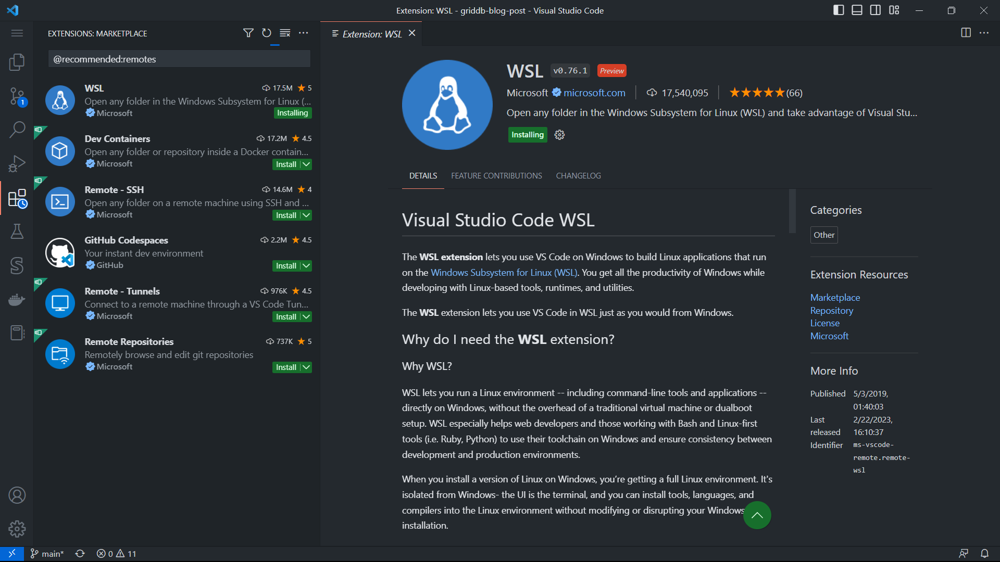

# Display World Population Data With Mapbox, Node.js and GridDB

In this blog, we will show you how to display world population data from [worldometers](https://www.worldometers.info/) using React, Mapbox GL JS, Node.js, and GridDB.

[main_poject_flow_image]

The flow for this project can be breakdown into a few steps:

## Data Acquisition

First, we need to get real-time data from [worldometers](https://www.worldometers.info/). This can be done by scrapping the website and getting the data that we need. The data will be extracted at regular intervals to keep it up-to-date.

## Back-end Development

We will use Node.js to code the server-side application server.

> Why Node.js? JavaScript is the lingua franca for full-stack application development, so it's the obvious choice.

The application server we make is API-based, and Node.js will interact with GridDB for data storage, handle retrieval data from worldometer, and handle requests and responses from the client UI.

## Front end Development

We use React.js to create the user interface. To display the world population data visually, we'll use Mapbox GL JS, a powerful mapping library. This library enables the creation of interactive, customizable maps. We'll integrate Mapbox GL JS with our React application to render a world map with markers or overlays representing the population data.

## Setup

Before we code the application, we need to set up the software and tools for development. We use Ubuntu 20.04 on WSL 2 on Windows 11 OS.

> WSL only available on Windows 10 version 2004 and higher (Build 19041 and higher). Go ahead to this [link](https://learn.microsoft.com/en-us/windows/wsl/install) for a new WSL installation.

## GridDB

[GridDB](https://griddb.net/en/)™ is a highly scalable, in-memory NoSQL time-series database optimized for IoT and Big Data. What's important to note is it has two types of container categories:

### Collection Containers

This type of container is similar to a traditional relational database. The data is stored as key values, and the collection container support basic CRUD (Create, Read, Update, and Delete) operation.

### TimeSeries Containers

This container is designed explicitly for managing time-series data, a sequence of data points indexed by time. Each record in a TimeSeries container has a timestamp, which serves as its unique key, and the data in this container is "append only" except upon deletion if requested.

### Installation

⚠️ GridDB deb package uses `systemd` but Ubuntu 20.04 on WSL 2 Windows 11 uses `SysVinit` so you need to enable `systemd` on Ubuntu WSL by editing file `/etc/wsl.conf` (create it if this file doesn't exist)

Inside your Ubuntu instance, add the following modification to `/etc/wsl.conf`[^1]

```ini
[boot]
systemd=true
```

Open Windows terminal to restart wsl with the following command

```powershell
wsl --shutdown
```

then start wsl again with the command

```powershell
wsl
```

then to install GridDB follow the installation instruction on [https://docs.griddb.net/latest/gettingstarted/using-apt/#install-with-apt-get](https://docs.griddb.net/latest/gettingstarted/using-apt/#install-with-apt-get).

Run GridDB and check if the service is running. Use this command

```zsh
sudo systemctl status gridstore
```

and if eveything ok you will get a message like this

```zsh
● gridstore.service - GridDB database server.
     Loaded: loaded (/lib/systemd/system/gridstore.service; enabled; vendor preset: enabled)
     Active: active (running) since Thu 2023-03-16 18:56:13 +07; 58min ago
    Process: 314 ExecStart=/usr/griddb/bin/gridstore start (code=exited, status=0/SUCCESS)
   Main PID: 393 (gsserver)
      Tasks: 34 (limit: 4605)
     Memory: 138.5M
        CPU: 20.129s
     CGroup: /system.slice/gridstore.service
             └─393 /usr/bin/gsserver --conf /var/lib/gridstore/conf

Mar 16 18:56:10 GenAI systemd[1]: Starting GridDB database server....
Mar 16 18:56:10 GenAI gridstore[314]: Starting gridstore service:
Mar 16 18:56:13 GenAI gridstore[392]: ..
Mar 16 18:56:13 GenAI gridstore[392]: Started node.
Mar 16 18:56:13 GenAI gridstore[314]: [ OK ]
Mar 16 18:56:13 GenAI systemd[1]: Started GridDB database server..
```

## Node.js

To install[^2] Node.js LTS follow the commands below

```zsh
curl -fsSL https://deb.nodesource.com/setup_18.x | sudo -E bash - &&\
sudo apt-get install -y nodejs
```

We will be using [griddb node-api](https://github.com/griddb/node-api) to connect our application with GridDB but before that wes should install the [griddb c client](https://github.com/griddb/c_client). The GridDB C Client provides a C interface for GridDB.

```zsh
wget https://github.com/griddb/c_client/releases/download/v5.0.0/griddb-c-client_5.0.0_amd64.deb
sudo dpkg -i griddb-c-client_5.0.0_amd64.deb
```

### GridDB node-api

To connect to GridDB from Node.js. we should using `griddb-node-api`. This package is built using node-addon-api and there are two ways to using it:

1.Compile from the source code. This way is the right way if you need to use griddb-node-api on specific node.js version.

```zsh
git clone git@github.com:griddb/node-api.git
cd node-api
npm install
```

if there is an error message like this

```zsh
gyp ERR! stack Error: not found: make
```

that's means you should install the `build-essentials` package in Ubuntu and if everything success you will get a file, `griddb.node` and then you need to include it in `NODE_PATH`

```zsh
export NODE_PATH=$(pwd)
```

2.Install the npm package `griddb-node-api` directly into our project.

```zsh
pnpm install griddb-node-api
```

We will use the second way for our project because it's simpler and we use Node 18 LTS.

## VSCode

As stated earlier, we use OS Ubuntu 20.04 on WSL Windows 11. To code from Windows, we use Visual Studio Code because it has a remarkable [remote WSL plugin](https://marketplace.visualstudio.com/items?itemName=ms-vscode-remote.remote-wsl)



Ok. That's a long setup before we code the application itself, but it's necessary so our development environment is transparent.

## Directory Project Structure

We use `pnpm` instead of npm because `pnpm` is storage efficient and support workspaces. We will create monorepo that hold server and client codes.

_Why monorepo?_

because it's good for the future development if you want to add another collaborator. Everyone will working on the same code base.

Start the project by create a directory for the monorepo

```zsh
mkdir world-population
cd world-population
pnpm init
```

then create `packages` directory that will hold our `server` and `client` projects.

```zsh
mkdir packages
mkdir paclages\server
mkdir packages\client
```

`pnpm` handling project workspaces by reading the config from `pnpm-workspaces.yaml`

```yaml
# pnpm-workspaces.yaml
packages:
  # all packages in direct subdirs of packages/
  - "packages/*
```

This tree structure might be typical of a Node.js project that has separate client and server codebases, organized as packages within a monorepo, and managed with the `pnpm` package manager.

```sh
.
├── .gitignore
├── package.json
├── packages
│   ├── server
│   └── client
└── pnpm-workspaces.yaml
```

## Let's Code

First we initialize the server project and install the main npm packages.

```sh
cd packages/server
pnpm init
cd ../../
pnpm --filter server install griddb-node-api express ws puppeteer
```

### Data Acquisition

This project use data from Worldometers.

> Worldometers, is a website that provides real-time statistics on various topics, including world population, government and economics, society and media, the environment, food, water, energy, and health.

There are a few ways to get data from a website:

1. By using their API.
2. By scrapping the website.

Unfortunately, Worldometers does not provide API, so our last option is to scrap the website.

One thing to note is Worldometers has dynamic data, meaning they provide real-time data. You cannot use JavaScript libraries such as Cheerio for data extraction. The best choice is to use Puppeteer to get such dynamic content.

> Puppeteer can be more resource-intensive as it launches a headless browser instance to render web pages. However, it offers more capabilities, such as handling dynamic content and user interactions.

There are two endpoint URLs that will provide us with the data. One is for the total world population and the second is for total world population by country.

- https://www.worldometers.info/world-population/
- https://www.worldometers.info/world-population/population-by-country/

```js
const worldPopDataSource = "https://www.worldometers.info/world-population/";
/**
 * fetch world population data
 */
const fetchWorldPopulationData = async () => {
  const browser = await puppeteer.launch();
  const page = await browser.newPage();

  await page.goto(worldPopDataSource);

  const extractData = async () => {
    // Extract data from the page
    const data = await page.evaluate(() => {
      const populationElement = document.querySelector(".rts-counter");
      const population = populationElement.textContent.replace(/[\n\s]+/g, "");
      return { population };
    });

    return data;
  };

  const popData = await extractData();
  await browser.close();

  return popData;
};
```

[^1]: https://ubuntu.com/blog/ubuntu-wsl-enable-systemd
[^2]: https://github.com/nodesource/distribution
